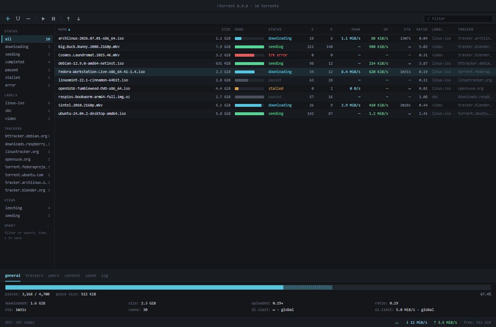
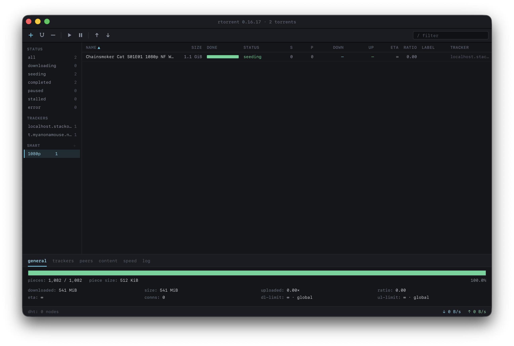
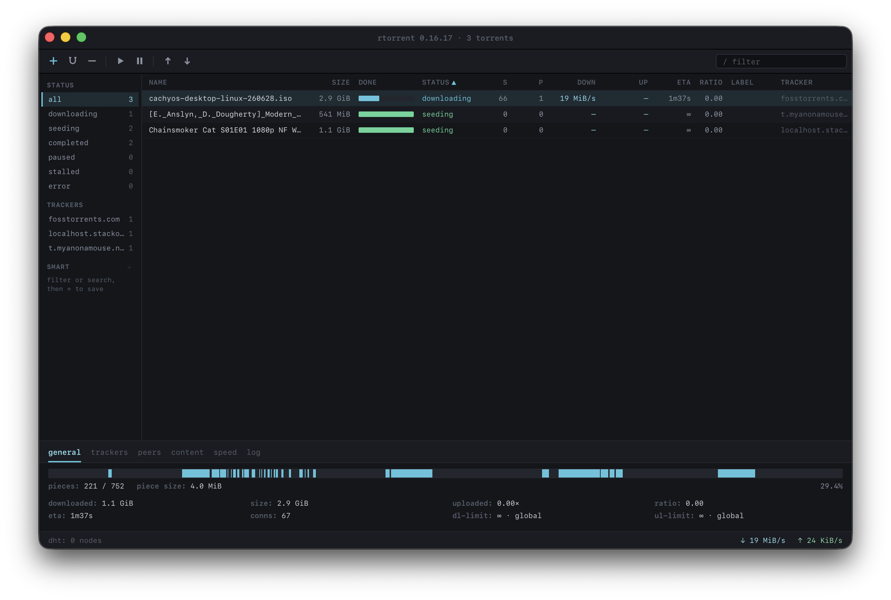
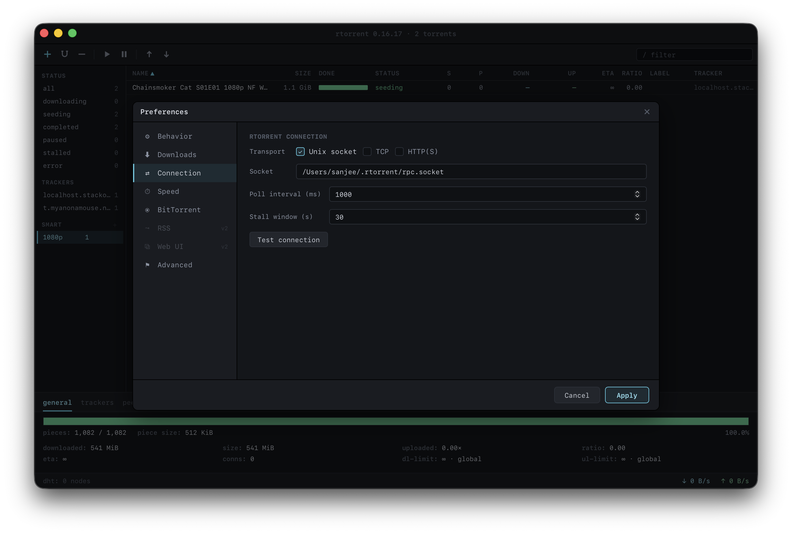

# rstorrent

A native desktop client for the [`rtorrent`](https://github.com/rakshasa/rtorrent)
daemon on **macOS and Windows**, built with **Rust + Tauri 2** and a
**React/TypeScript** frontend. It implements the "Dark Ops" design in
[`design/`](design/): a compact, monospace, power-user torrent client in the
mold of qBittorrent, front-ending rtorrent over its XML-RPC interface.

rtorrent has no Windows build, so the Windows app drives a daemon running in
WSL2 and translates paths across the boundary — see
[docs/wsl-setup.md](docs/wsl-setup.md).

rstorrent is a *client* — it does not embed a BitTorrent engine.



## Status

Milestones M0–M1 are complete: a live main window (toolbar, filter sidebar,
sortable torrent table, detail tabs, status bar) driven by a background poller,
running against either a live daemon or the built-in mock. Verified against
Homebrew's **rtorrent 0.16.17** on macOS, and **rtorrent 0.16.18** built in WSL
on Windows.

See [plan.md](plan.md) for the architecture, [tasks.md](tasks.md) for the
execution tracker, and [backlog.md](backlog.md) for what's being considered next.

## Features

**Transports** — a local unix socket (the macOS default; SCGI is
unauthenticated, so keeping it off the network is the safe posture), a TCP port
(the Windows default, bridged into WSL over loopback), or XML-RPC over HTTP(S)
with basic auth for a remote seedbox. Remote passwords live in the macOS
Keychain or Windows Credential Manager, never in `settings.json`. Actions that
only make sense for local files — delete-data, reveal-in-file-manager,
free-space — are disabled for a remote daemon.

**Adding torrents** — `.torrent` file association and the `magnet:` URL scheme,
drag & drop onto the window, ⌘V to add from the clipboard, and a watch folder.

**The table** — sortable, resizable, customizable columns; multi-select with a
summary bar for bulk resume/pause/remove; a filter sidebar with status, label and
tracker groups, plus saved smart filters that AND several dimensions together.



**Detail tabs** — General (with a pieces bar showing which chunks have landed),
Trackers (add/remove/enable/reannounce), Peers, Content, Speed, and Log.



**Automation** — per-torrent speed limits via named throttle pools, and ratio
groups / seed goals set globally or per label.

## Quick start

```sh
npm install

# Run against the ten built-in fixture torrents — no daemon needed:
RSTORRENT_MOCK=1 npm run tauri dev      # PowerShell: $env:RSTORRENT_MOCK=1

# Run against a real daemon:
#   macOS   — see docs/rtorrent-setup.md
#   Windows — see docs/wsl-setup.md
npm run tauri dev
```

Mock mode is the fastest way to see the UI: it serves ten fixture torrents in
assorted states, with no rtorrent and no network.

## Connecting

Install and configure a daemon per [docs/rtorrent-setup.md](docs/rtorrent-setup.md),
then open **Preferences → Connection**, match the transport to your
`.rtorrent.rc`, and hit **Test connection** — it reports the rtorrent version.



## Development

| Command | What it does |
|---|---|
| `npm run tauri dev` | Run the app (add `RSTORRENT_MOCK=1` for mock mode) |
| `npm test` | Frontend unit tests (Vitest) |
| `npm run typecheck` | `tsc --noEmit` |
| `npm run lint` | ESLint + Prettier check |
| `cargo test` (in `src-tauri/`) | Rust unit tests |
| `cargo clippy --all-targets -- -D warnings` | Rust lints |
| `npm run tauri build` | Package `.app`/`.dmg` (macOS) or `.msi`/NSIS `.exe` (Windows) |

Tests that touch a live daemon or the Keychain are marked `#[ignore]` and are run
deliberately — see [docs/rtorrent-setup.md](docs/rtorrent-setup.md).

## Layout

```
plan.md · tasks.md · backlog.md   # architecture, tracker, ideas
design/                           # the "Dark Ops" design reference (authoritative)
docs/rtorrent-setup.md            # connecting to a live rtorrent (macOS)
docs/wsl-setup.md                 # connecting to rtorrent in WSL (Windows)
docs/images/                      # README screenshots
src/                              # React frontend (ipc, store, components, theme)
src-tauri/src/                    # Rust backend (rtorrent transports, poller, commands)
src-tauri/src/wsl.rs              # Windows-only: path translation across the WSL boundary
tools/scgi-http-bridge.py         # dev-only HTTP→SCGI bridge, stands in for nginx
tools/wsl-setup-rtorrent.sh       # builds rtorrent inside WSL and starts it under systemd
```

## License

TBD.
