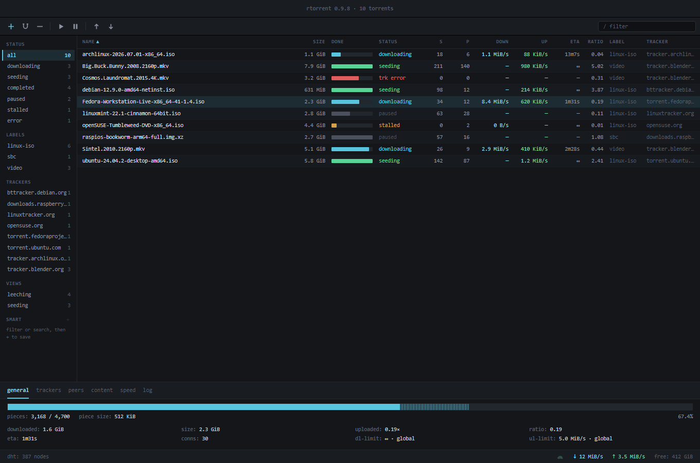
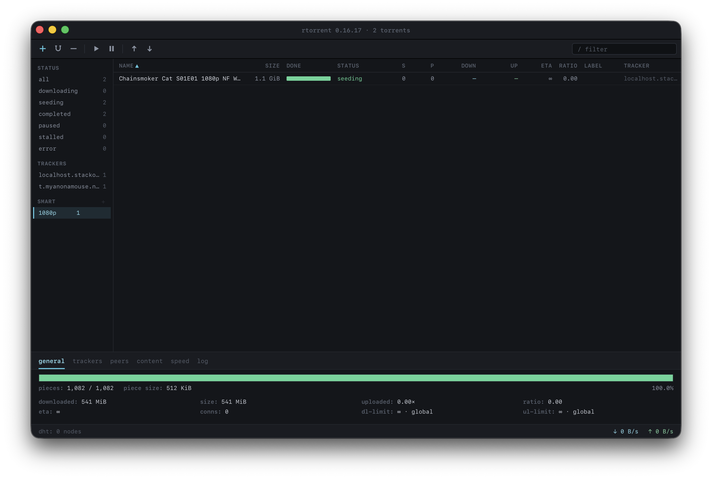
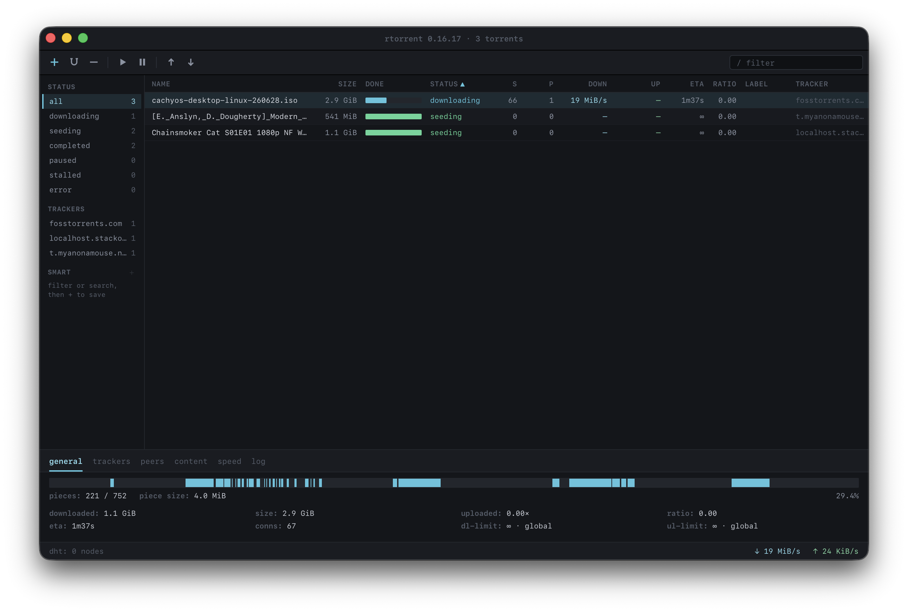
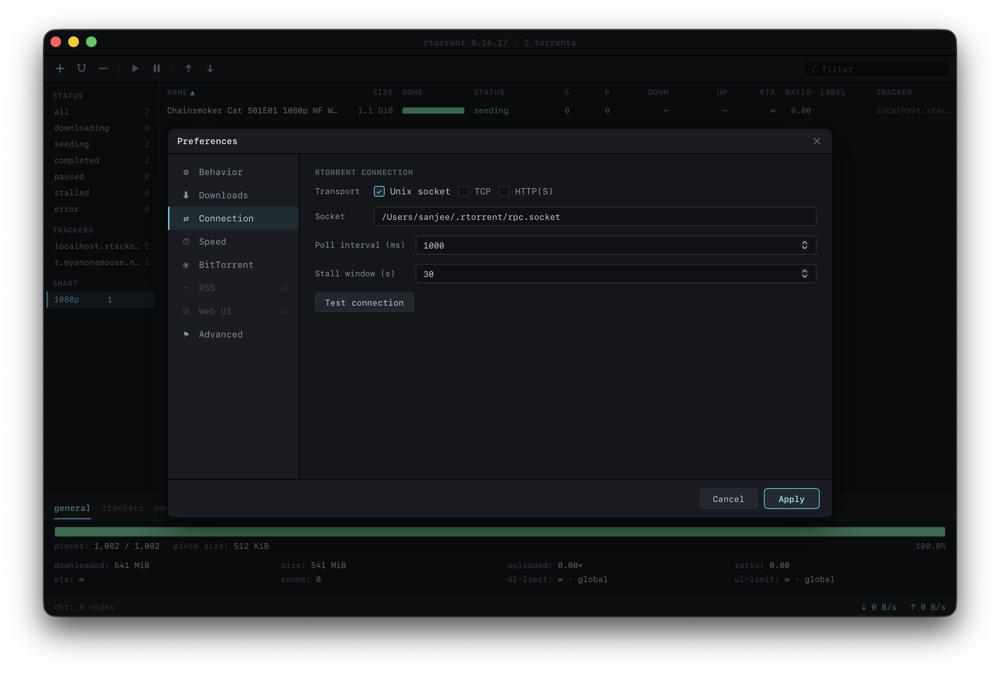

# rstorrent

[](https://github.com/s4njee/rstorrent/actions/workflows/ci.yml)

A native desktop client for the [`rtorrent`](https://github.com/rakshasa/rtorrent)
daemon on **macOS and Windows**, built with **Rust** and a native **GPUI**
desktop shell and a **React/TypeScript** web console. It implements the "Dark
Ops" design in [`design/`](design/): a compact, monospace, power-user torrent
client in the mold of qBittorrent, front-ending rtorrent over its XML-RPC
interface.

Both apps **ship their own rtorrent**, so there is nothing to install first. On
macOS it is a separate executable inside the `.app`. rtorrent has no Windows
build, so the Windows app ships a static Linux rtorrent as a small WSL2 distro
of its own, imports it on first start, and translates paths across the
boundary. The Windows build is new and still being verified; see
[windows.md](windows.md).

rstorrent is a *client* — it does not embed a BitTorrent engine in-process; it
speaks to rtorrent (bundled on macOS, system, or remote) over XML-RPC.

The desktop app is the native **GPUI** shell in [`crates/gpui`](crates/gpui)
(see [GPUI.md](GPUI.md)). The earlier Tauri + React desktop shell has been
removed; a few of its features are not ported yet — the tray, drag & drop onto
the window, paste-to-add, the watch-folder runner and `.torrent`/`magnet:`
association (GPUI.md §4). The web console keeps the React UI.



## Build the app

One command builds the app and everything inside it — the bundled rtorrent
(built from source on the first run, reused after), the web console the binary
embeds, and the macOS `.app` with the runtime in it:

```sh
tools/bundle-gpui-macos.sh
```

That leaves `dist-gpui/rstorrent-gpui.app`, ready to run or to hand to someone:

```sh
open dist-gpui/rstorrent-gpui.app

ditto -c -k --sequesterRsrc --keepParent \
  dist-gpui/rstorrent-gpui.app dist-gpui/rstorrent-gpui.app.zip
```

The first run is the slow one: it builds libtorrent and rtorrent 0.15.7 from
source into `~/.cache/rstorrent-build` and reuses them from then on. It needs
the Rust toolchain, Node, and Homebrew with `curl openssl@3 ncurses tinyxml2`.
The result is ad-hoc signed rather than notarized, so Gatekeeper warns on first
launch on another machine — see [docs/release.md](docs/release.md).

On Windows the equivalent is `tools\bundle-gpui-windows.ps1`, which produces a
portable zip with the WSL runtime beside the exe — see [windows.md](windows.md).

## Status

The core client and several feature slices have shipped: a live main window
(toolbar, filter sidebar, sortable torrent table, detail tabs, status bar)
driven by a background poller, plus a network-preferences pane, per-torrent and
automation controls, connection profiles, native daemon views, and RSS
auto-add. Verified against Homebrew's **rtorrent 0.16.17** on macOS, and
**rtorrent 0.16.18** built in WSL on Windows. The macOS `.app` bundles its own
**rtorrent 0.15.7** — built from source by
[`tools/build-rtorrent-macos.sh`](tools/build-rtorrent-macos.sh) and staged in
`binaries/rtorrent-macos/` — and prefers it over any system install. See
[backlog.md](backlog.md) for the shipped-so-far list and what's next.

See [plan.md](plan.md) for the architecture, [tasks.md](tasks.md) for the
execution tracker, and [backlog.md](backlog.md) for what's being considered next.

## Features

**Transports** — a local unix socket (the macOS default; SCGI is
unauthenticated, so keeping it off the network is the safe posture), a TCP port
(the Windows default, bridged into WSL over loopback), or XML-RPC over HTTP(S)
with basic auth for a remote seedbox. Remote passwords live in the macOS
Keychain or Windows Credential Manager, never in `settings.json`. Actions that
only make sense for local files — delete-data, reveal-in-file-manager,
free-space — are disabled for a remote daemon.

**Adding torrents** — a `.torrent` picker with metadata and a contents tree, a
magnet/URL dialog that offers a magnet already on the clipboard, and Create
torrent. (File association, drag & drop and the watch folder are not yet ported
to the GPUI shell.)

**The table** — sortable, resizable, customizable columns; multi-select with a
summary bar for bulk resume/pause/remove; a filter sidebar with status, label and
tracker groups, plus saved smart filters that AND several dimensions together.



**Detail tabs** — General (with a pieces bar showing which chunks have landed),
Trackers (type / announce timing / add / remove / enable / reannounce), Peers
(with per-peer ban / snub / disconnect), Content (per-file priorities), Speed,
and Log.



**Network** — a Preferences pane for protocol encryption/PEX, an HTTP tracker
proxy, and bind/listen addresses (bind to a VPN interface so traffic dies with
the tunnel), plus global peer and connection-slot caps. A one-click **Tune for
1 Gbps** menu action writes a managed block to `.rtorrent.rc` and applies it
live.

**Automation** — per-torrent speed limits via named throttle pools; ratio
groups / seed goals (stop, or auto-remove) set globally or per label; a
max-active-downloads queue; multiple watch folders and per-label default save
paths; a run-on-complete command hook; and turtle mode (alternative limits on a
manual toggle or a daily schedule).

**Seedbox** — saved connection profiles to switch daemons, the daemon's own
native views surfaced in the sidebar, a Daemon menu (save session / shut down),
a daemon-health tab in Statistics, and RSS feeds with auto-download rules.

## Quick start

```sh
npm ci && npm run build:web     # the app embeds the web console at compile time

# Run against the ten built-in fixture torrents — no daemon needed:
cargo run -p rstorrent-gpui -- --demo

# Run against a real daemon (the app starts the bundled one if none answers):
#   macOS   — build the bundled one with tools/build-rtorrent-macos.sh,
#             or use a system rtorrent; see docs/rtorrent-setup.md
#   Windows — see windows.md
cargo run -p rstorrent-gpui
```

Mock mode is the fastest way to see the UI: it serves ten fixture torrents in
assorted states, with no rtorrent and no network.

## Connecting

On macOS the app ships its own rtorrent: hit **Start rtorrent** on the
disconnected card (or **Daemon → Start Daemon**) and it launches the bundled
0.15.7 daemon, writing a starter `~/.rtorrent.rc` if you have none. To use a
system or remote daemon instead, follow
[docs/rtorrent-setup.md](docs/rtorrent-setup.md), then open
**Preferences → Connection**, match the transport to your `.rtorrent.rc`, and
hit **Test connection** — it reports the rtorrent version.



## Web UI

A React UI runs in a browser, served by a small self-hosted server
(`rstorrent-web`) that sits next to the daemon and proxies its XML-RPC/SCGI
interface as JSON. The desktop app can also serve it itself (one menu item,
GPUI.md §10). Single-password login, session cookie, delete-with-data gated to
co-located daemons.

```sh
# Develop against the fixtures with no daemon:
RSTORRENT_MOCK=1 cargo run -p rstorrent-web     # server + embedded UI at :9080
npm run dev:web                                  # or Vite on :1421, proxying /api → :9080

# Ship it:
npm run build:web && cargo build --release -p rstorrent-web
```

See [docs/web-setup.md](docs/web-setup.md) for configuration, Docker, systemd,
and reverse-proxy (TLS) setup.

## Development

| Command | What it does |
|---|---|
| `cargo run -p rstorrent-gpui` | Run the desktop app (add `-- --demo` for fixtures) |
| `RSTORRENT_MOCK=1 cargo run -p rstorrent-web` | Run the web server against fixtures |
| `npm run build:web` | Build the browser SPA the server embeds |
| `npm test` | Frontend unit tests (Vitest) |
| `npm run check:contrast` | Palette contrast floors + colour-literal guard (see `docs/web-console-plan.md`) |
| `npm run typecheck` | `tsc --noEmit` |
| `npm run lint` | ESLint + Prettier check |
| `cargo test --workspace` | Rust unit tests |
| `cargo clippy --workspace --all-targets` | Rust lints |
| `cargo fmt --check --all` | Rust formatting |
| `tools/bundle-gpui-macos.sh` | Package the macOS `.app` (bundled rtorrent inside) |
| `tools\bundle-gpui-windows.ps1` | Package the Windows zip (WSL runtime beside the exe) |

CI ([`.github/workflows/ci.yml`](.github/workflows/ci.yml)) runs all of the
above on push and PR — the frontend and shared-crate checks on Linux, the GPUI
app on macOS and Windows.

Tests that touch a live daemon or the Keychain are marked `#[ignore]` and are run
deliberately — see [docs/rtorrent-setup.md](docs/rtorrent-setup.md).

## Layout

This is a Cargo workspace: the rtorrent client layer is a UI-free crate that
both the desktop app and the web server share.

```
plan.md · tasks.md · backlog.md   # architecture, tracker, ideas
Cargo.toml                        # workspace: crates/rtorrent · crates/gpui · server
design/                           # the "Dark Ops" design reference (authoritative)
docs/rtorrent-setup.md            # connecting to a live rtorrent (macOS)
windows.md                        # the Windows build: bundled WSL runtime, bring-up checklist
docs/wsl-setup.md                 # a hand-installed rtorrent in your own WSL distro
docs/web-setup.md                 # self-hosting the web UI (server + reverse proxy)
docs/images/                      # README screenshots (regenerated from the demo)
demo.html · src/demo/             # browser demo: the web UI over an in-memory backend + fixtures
crates/rtorrent/                  # rtorrent-core: SCGI/HTTP transports, XML-RPC, DTOs, mock
crates/gpui/                      # rstorrent-gpui: the native desktop app (macOS, Windows)
src/                              # React frontend for the web console (store, components, theme)
src/web/ · web.html               # the browser web UI shell (WE) over an HTTP backend
server/src/                       # rstorrent-web: axum server proxying the daemon as JSON
crates/gpui/src/wsl.rs            # Windows: path translation across the WSL boundary
binaries/rtorrent-macos/          # the bundled macOS runtime (built, gitignored)
binaries/rtorrent-wsl/            # the bundled Windows runtime, a WSL rootfs (built, gitignored)
tools/scgi-http-bridge.py         # dev-only HTTP→SCGI bridge, stands in for nginx
tools/build-rtorrent-macos.sh     # builds the bundled rtorrent + libtorrent for the .app
tools/build-rtorrent-wsl.sh       # builds the Windows runtime (static rtorrent in an Alpine rootfs)
tools/bundle-gpui-{macos.sh,windows.ps1}  # package the app for each platform
tools/wsl-setup-rtorrent.sh       # builds rtorrent inside WSL and starts it under systemd
```

## License

TBD.
